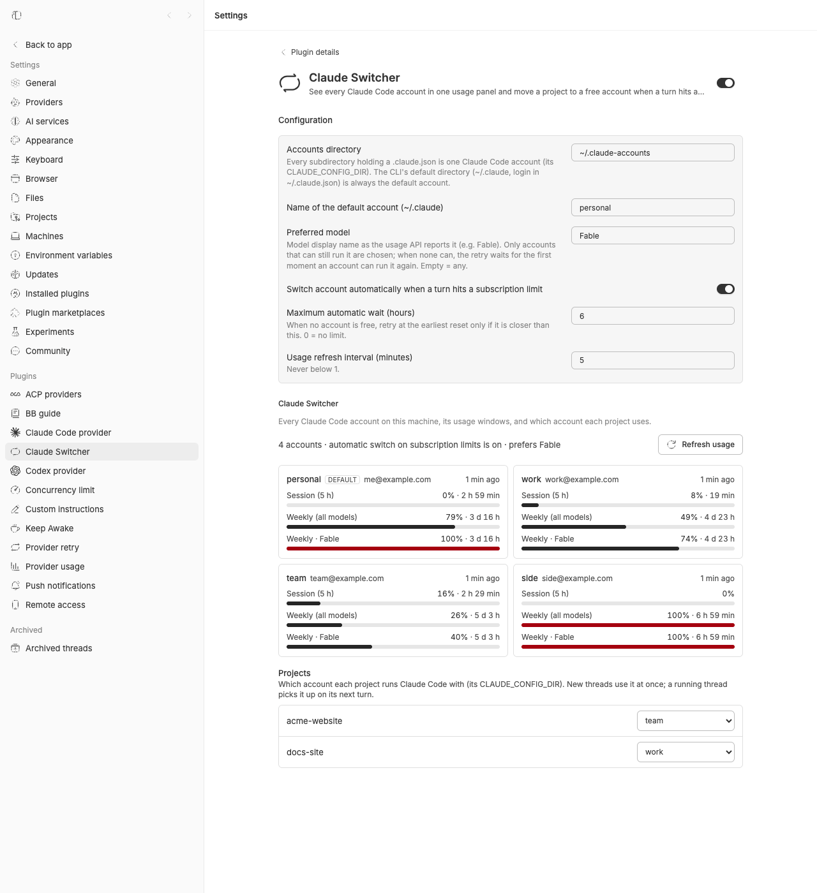
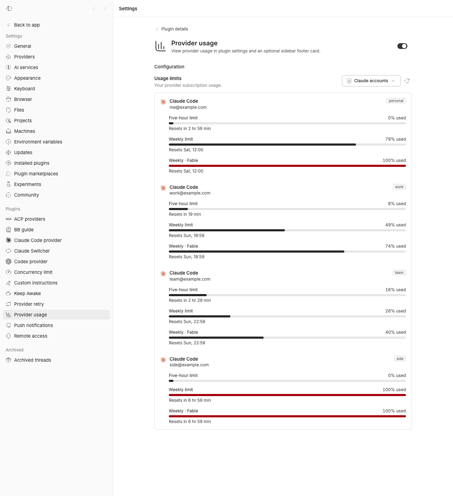
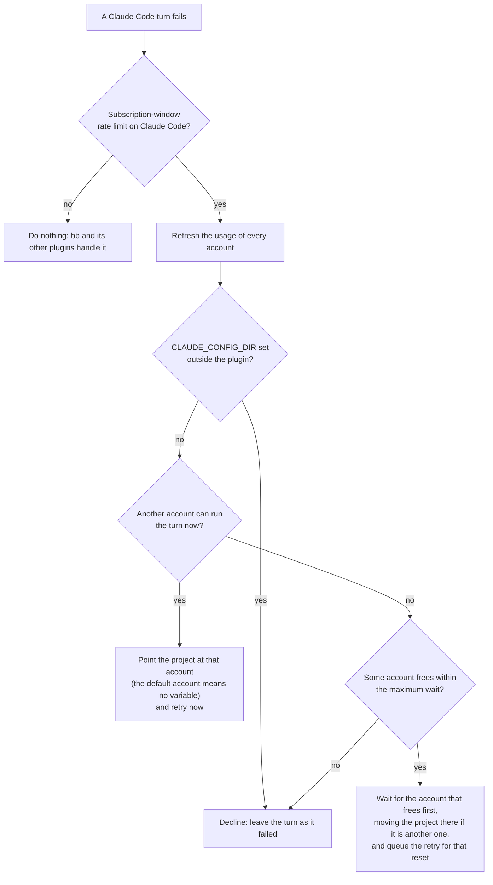

<div align="center">


# Claude Switcher

### Keep working when one Claude Code account hits its limit.

Every Claude Code account on your machine in bb's usage panel.<br>
When a turn hits a subscription limit, the project moves to a free account and the turn runs again.

[](https://github.com/Finolaina/bb-plugin-claude-switcher/actions/workflows/check.yml)
[](LICENSE)
[](https://github.com/get-bb/bb)
[](https://www.npmjs.com/package/@get-bb/plugin-sdk)
[](#install)
[](tsconfig.json)

[Features](#features) · [Install](#install) · [Accounts](#setting-up-extra-accounts) · [How it works](#how-it-works) · [Safety](#safe-by-default) · [CLI](#cli) · [Settings](#settings) · [Design doc](docs/DESIGN.md)

<br>



</div>

<br>

## The problem

You pay for more than one Claude Code subscription so that a limit doesn't
stop you. Then a turn fails with a 5-hour or weekly limit in the middle of
the work.

bb shows the usage of the account it runs on and retries at the reset. It
doesn't know about your other accounts, so you log in to another one by
hand, or wait hours for a reset while the other subscription sits idle.

**Claude Switcher measures every account and moves the project** to the
best free one the moment a turn fails on a subscription limit, then runs
the turn again there. When none is free, it waits for the one that frees
first.

|                                                | Without Claude Switcher |    With Claude Switcher     |
| ---------------------------------------------- | :---------------------: | :-------------------------: |
| See every account's session and weekly windows |           ❌            |    ✅ in Provider usage     |
| Keep working when one account hits its limit   |           ❌            |     ✅ switch and retry     |
| Start a new project on an account that works   |           ❌            |  ✅ when its thread opens   |
| Wait for the account that frees first          |           ❌            | ✅ within your maximum wait |
| Stick to a model, like Fable                   |            n/a            |     ✅ preferred model      |
| Choose the account of each project by hand     |           ❌            | ✅ thread header, picker and CLI |
| Touches a `CLAUDE_CONFIG_DIR` it didn't set    |            n/a            |          ❌ never           |
| Shares or pools accounts between people        |            n/a            |          ❌ never           |

## Features

<table>
<tr>
<td width="50%" valign="top">

### 📊 Every account in one panel

The 5-hour session, the weekly and the per-model weekly windows of each
account appear in **Provider usage**, next to the usage bb already shows.
Refreshed in the background and on demand.

</td>
<td width="50%" valign="top">

### 🔁 Automatic switch and retry

When a turn fails on a **subscription-window** rate limit, the project
moves to the best other account and the failed turn runs again there.

</td>
</tr>
<tr>
<td valign="top">

### ⏳ Waits instead of giving up

When no account is free, the project moves to the account that frees
first and the retry is queued for that reset, within a maximum wait you
choose.

</td>
<td valign="top">

### 🎯 A preferred model

Name one (for example `Fable`) and only accounts that can still run it are
chosen. The three Claude Code limits are never treated as interchangeable.

</td>
</tr>
<tr>
<td valign="top">

### 🎛️ Manual control

A **Claude Switcher** section in Settings with the account cards, a
per-project account picker, a refresh button and the last automatic
switch, plus a `bb claude-switcher` CLI.

</td>
<td valign="top">

### 🤝 Plays well with bb

It cooperates with bb's bundled **provider-retry** plugin, uses only
public SDK surfaces, and never touches a `CLAUDE_CONFIG_DIR` it did not set.

</td>
</tr>
</table>

<div align="center">
<table>
<tr>
<td align="center"><br><sub><b>Every account in Provider usage</b></sub></td>
<td align="center"><br><sub><b>The account each project runs on</b></sub></td>
</tr>
</table>
</div>

## Install

```sh
bb plugin install git:https://github.com/Finolaina/bb-plugin-claude-switcher@^0.2.2
```

Then open **Settings → Claude Switcher** (or run
`bb plugin config claude-switcher`), point it at your accounts directory
and set up the extra accounts as described [below](#setting-up-extra-accounts).
Once the plugin is listed in bb's catalog you can also install it from
**Plugins → Browse plugins**, or with `bb plugin install claude-switcher`.

<details>
<summary><b>Install from a local clone</b></summary>

```sh
git clone https://github.com/Finolaina/bb-plugin-claude-switcher.git
cd bb-plugin-claude-switcher
npm install          # dependencies the settings section imports
bb plugin install .  # bb builds the plugin at install time
```

</details>

**Requirements**

- **bb 0.44 or later** (plugin SDK 0.5.29 or later) running on the machine
  that holds the Claude Code logins: macOS (keychain) or Linux
  (credentials file). The plugin runs inside bb's server process.
- **Threads that run on that same machine.** `CLAUDE_CONFIG_DIR` is set as
  a project **machine** environment variable holding a path on bb's
  machine. A thread that runs on another host may get that path, which
  does not exist there; if you run threads on other hosts, turn
  `autoSwitch` off (it is global: there is no per-project opt-out).
- **More than one Claude Code login**, each in its own config directory,
  set up as described in [Setting up extra accounts](#setting-up-extra-accounts).

## Setting up extra accounts

The default account is `~/.claude`, the CLI's own directory (its login
lives in `~/.claude.json`). Every other account is a subdirectory of the
_accounts directory_ setting (`~/.claude-accounts` by default) that
contains a `.claude.json`.

**1. Share what a thread needs.** A switch changes the whole config
directory of the project: Claude Code reads its settings, hooks,
`CLAUDE.md`, plugins and, above all, the session transcripts
(`<dir>/projects/`) from there. A fresh directory has none of them, and a
thread whose transcript lives under another directory cannot be resumed
("No conversation found with session ID"). Symlink what must follow the
thread from `~/.claude` into each account directory before its first use,
at least `projects`, and normally `settings.json`, `hooks`, `CLAUDE.md`
and `plugins`:

```sh
acct=~/.claude-accounts/work
mkdir -p "$acct"
for f in projects settings.json hooks CLAUDE.md plugins; do
  [ -e ~/.claude/$f ] || continue
  [ -L "$acct/$f" ] || { [ -e "$acct/$f" ] && mv "$acct/$f" "$acct/$f.orig.$(date +%Y%m%d%H%M%S)"; }
  ln -sfn ~/.claude/$f "$acct/$f"
done
```

Run it when you create the directory or later; it is safe to repeat.
What Claude Code already created there is kept as `<name>.orig.<time>`,
so transcripts of sessions already run on that account stay in
`projects.orig.<time>` (move them into `~/.claude/projects/` if you want
to resume them). A plain `ln -s` is wrong once `projects/` exists: it
links inside it and says nothing.

**2. Log in once**, with the exact path the _accounts directory_ setting
names (no trailing slash: Claude Code keys the login by that string):

```sh
CLAUDE_CONFIG_DIR=~/.claude-accounts/work claude   # then /login
```

The plugin finds the new account on its next refresh.

MCP servers added with `claude mcp add -s user` live in each directory's
`.claude.json` (it also holds the login, so it cannot be shared): add them
again per account, or use a project-level `.mcp.json`. Without shared
transcripts, the retry of the failed turn itself fails with "No
conversation found", no thread can move between accounts in either
direction (a thread whose project is placed on another account right
after its first turn fails the same way at its second), and a thread that
starts on a fresh account runs without your settings, hooks and
`CLAUDE.md`.

## Where to find it

| Where                                                | What                                                                                                                                                       |
| ---------------------------------------------------- | ---------------------------------------------------------------------------------------------------------------------------------------------------------- |
| **A Claude Code thread's header**                    | The project's account with a dot (green: room, amber: running low, red: out or not logged in, grey: not measured), and a menu to switch now to the best account or pick any other. |
| **Settings → Claude Switcher**                       | The six settings, a card per account with its windows, the account each project runs on (with a picker), **Refresh usage**, and the last automatic switch. |
| **Settings → Provider usage** (and its sidebar card) | Pick **Claude accounts** in the source menu to see every account's session, weekly and per-model windows.                                                  |
| **A thread's retry reason**                          | `Switched to account <name>`, `Waiting for <name>` or `Retrying on account <name>`, wherever bb shows why a turn was retried.                              |
| **`bb plugin logs claude-switcher`**                 | Every switch, wait and decline, with its reason.                                                                                                           |
| **`bb claude-switcher`**                             | The CLI: `list`, `refresh`, `use`, `release`.                                                                                                              |

## How it works

One account is one Claude Code config directory (`CLAUDE_CONFIG_DIR`).
The plugin measures every account in the background. When a turn fails,
it decides between three outcomes:



- **When a thread is created.** A project created after the plugin first
  ran (for an update from 0.2.1, after the first start of 0.2.2) goes to
  the best account, and a project whose account is already measured out
  moves to another one. This races the thread's first turn: if the turn
  starts first on the old account and fails, it is retried once on the
  new account; if it succeeds there, the thread's next turns run on the
  new account, which needs the shared transcripts described in
  [Setting up extra accounts](#setting-up-extra-accounts). A project you
  pinned by hand (the default account included) stays put while its
  account works.
- **Only visible threads.** Hidden threads (another plugin's workers) are
  left alone, both when they are created and when they fail.
- **Per project, not per thread.** The switch sets `CLAUDE_CONFIG_DIR` on
  the thread's project, so the project's next turns run on the new account
  too. A retry keeps the thread's model: the plugin changes which account
  runs a thread, never which model it runs.
- **One retry per turn.** bb's bundled **provider-retry** plugin also
  queues a retry at the reset the provider reported, and bb keeps a single
  retry per turn. After switching, this plugin sends the retry
  provider-retry already queued (the project is on the new account by
  then) instead of queueing a second one; when it has to wait, it replaces
  that retry with its own timed one. Keep provider-retry enabled: disabling
  it is global and would also drop its retries for overloads and for other
  providers.
- **Stops after five attempts** on the same turn, like provider-retry.

The design, the reasons behind each rule and the measured behaviour are in
**[docs/DESIGN.md](docs/DESIGN.md)**.

<details>
<summary><b>The switch policy in full</b></summary>

The three Claude Code limits reset on their own clocks and are **not**
interchangeable. An account is usable while its session and weekly
windows are both present and under 100 %, and the provider reports no
lock. A window whose reset time has passed counts as free even if the
last measurement said otherwise. One exception: when the last measurement
is older than twice the refresh interval and the usage endpoint has
failed since, a block that only the clock says is over (for the whole
account or for the preferred model) is not trusted, and an account whose
only blocks are of that kind is left out; if no account is left, the
plugin declines rather than guess. A block whose reset is still ahead
remains a reason to wait, and an old measurement that was free remains a
candidate.
Usable accounts are ranked by the closest weekly reset, then by the lowest
session use, then by name. With a preferred model, only accounts that can
still run it are chosen. The account that just failed is excluded from
that decision and is never expected back before the reset the provider
itself reported for it.

A switch sets `CLAUDE_CONFIG_DIR` on the thread's **project** and retries
the failed turn. A wait moves the project to the account that frees first
(when that is another one; an exact tie stays on the current account, then
goes by name) and retries with `sendAt` at that reset, plus a 15 s buffer
and up to 30 s of jitter, like bb's own provider-retry plugin; both stop
after 5 attempts. The reasons this plugin writes are
`Switched to account <name>[ (<model>)]`, `Waiting for [<model> on ]<name>`
and `Retrying on account <name>`, plus two for moves made when a thread is
created: `New project placed on account <name>[ (<model>)]` and
`Moved to account <name> before the turn: <old> cannot run <model>` (or
`is out of usage` without a preferred model). Every one goes to
`bb plugin logs claude-switcher`; the one that moved the project is also
in **Settings → Claude Switcher** ("Last automatic switch"); the reason
stored with a retry this plugin created is shown wherever bb shows a
retry's reason.

A turn that started on the project's old account (the plugin notes the
account when a thread turns active) is retried once on the new one
whenever it fails, even long after the move: a long tool call can outlast
any window. Not when the new account has no login or is measured out: then
the failure is judged like any other.
For a minute after a switch or a wait, other turns of the same project
that were still running keep failing; each of those is retried once as it
is, on the new account (or queued for the same reset, after a wait),
without a second switch. A thread that fails again inside that minute is
judged afresh: the new account fails too. So is any failure once the new
account is measured out of usage or without a login (a wait keeps its
minute: that account is out until its reset). Picking an account by hand
(in a thread's header, in Settings or with `use`) gives the same minute,
so a turn still running on the old account follows your pick, unless the
picked account is measured out or has no login.

The plugin only ever changes a `CLAUDE_CONFIG_DIR` it wrote itself. A
project whose variable was set by hand or inherited from the global
environment is shown as external, never switched, and its picker is
disabled. A variable of its own that names an account that no longer
exists counts as "no account": the picker shows "account no longer exists:
pick one" until the next switch or pick replaces it. Accounts without a
login are listed in the picker as "(not logged in)"; pinning one is
allowed, and the project then runs on it as soon as you log in there.

</details>

<details>
<summary><b>The bb surfaces it uses</b></summary>

The plugin uses only public surfaces of the bb plugin SDK. Four are marked
experimental and may change: the thread header slot, the `experimental_Icon`
component, and the `experimental_discoverable` and `experimental_description`
options of the Provider usage source. The thread header control is registered only when
the host offers that slot, so a bb without it keeps the Settings section.

| bb surface                                                       | What the plugin does with it                                                               |
| ---------------------------------------------------------------- | ------------------------------------------------------------------------------------------ |
| Provider usage source (the panel's RPC contract)                 | Publishes one resource per account, with its session, weekly and per-model windows.        |
| `turn.failed` event                                              | Detects subscription-window rate limits of the Claude Code provider.                       |
| `thread.created` event and `projects.get`                        | Places a project when one of its threads is created (a new project by its creation date).  |
| Project machine environment variables                            | Sets `CLAUDE_CONFIG_DIR` on the project, with a note naming the account.                   |
| `threads.retry` and queued messages                              | Retries the failed turn now, or at a reset, and reuses the retry provider-retry queued.    |
| Settings and a settings section                                  | The six settings, plus the per-project picker and the account cards.                       |
| `experimental_threadHeaderAction` slot and `threads.get`         | The account control in a Claude Code thread's header. Experimental in bb: it may change.   |
| CLI registration                                                 | `bb claude-switcher list`, `refresh`, `use` and `release`.                                 |
| Background service, key-value storage, realtime signals, logging | Periodic usage refresh, the last automatic switch, the install time and the new projects already handled, live updates of the section, and a log. |

</details>

## Safe by default

- 🔒 **Only its own variables.** It changes a `CLAUDE_CONFIG_DIR` only if
  it wrote it (recognised by its note). One set by hand or inherited is
  shown as external and never touched.
- 🏠 **Nothing leaves your machine** except calls to Anthropic's own
  endpoints: the usage endpoint behind `claude`'s `/usage` and, when a
  token has expired, the OAuth refresh the CLI itself uses. No telemetry,
  no third-party services.
- 🔑 **Logins stay where they are.** A rotated token is written back where
  the CLI keeps it and verified by reading it again; if the store rejects
  it, it is kept in memory, reported in the panel and written as soon as
  the store works again.
- 👤 **Never shares accounts.** It moves projects between logins that
  already exist on the machine; it never logs anyone in and never shares
  or pools accounts between people.
- 🛑 **Knows when to stop.** Limits that are not Claude Code
  subscription-window limits are left to bb, a turn is tried at most five
  times, and a wait longer than your maximum is declined.
- 📝 **Everything is logged.** Every switch, wait and decline, and every
  placement or reason for leaving a project where it was, is written to
  `bb plugin logs claude-switcher` with its reason.

<details>
<summary><b>Privacy and security in detail</b></summary>

- The plugin reads the OAuth token Claude Code stored for each login on
  the machine: the macOS keychain (`Claude Code-credentials` for
  `~/.claude`, `Claude Code-credentials-<sha256(NFC(dir))[:8]>` for the
  others) or `<dir>/.credentials.json` elsewhere.
- It calls only Anthropic's own endpoints: the usage endpoint behind
  `claude`'s `/usage` (`GET https://api.anthropic.com/api/oauth/usage`)
  and, when a token has already expired, the OAuth endpoint the CLI uses
  to refresh it, with Claude Code's public OAuth client id. The rotated
  token is written back where the CLI keeps it and verified by reading it
  again; if the store rejects it, it stays in memory, is reported in the
  panel and is written as soon as the store works again, because the
  refresh token rotates and losing it logs the account out.
- Known limit: refreshing rotates the refresh token. If a running
  `claude` session of the same account refreshes between the plugin's
  read and its write, or bb stops while a rotated login is still only in
  memory, that account can be logged out and needs `/login` again.
- It does this in the background whether or not `autoSwitch` is on.
- No telemetry, no third-party services, no data leaves the machine except
  those calls to Anthropic. It moves projects between logins that already
  exist; it never logs anyone in and never shares or pools accounts
  between people.
- Like every bb plugin, it is full-trust code running in bb's server
  process. See [SECURITY.md](SECURITY.md) to report a vulnerability.

</details>

## CLI

`bb claude-switcher <command>`:

```sh
bb claude-switcher list [--json]          # windows per account, account per project
bb claude-switcher refresh [--json]       # query the usage endpoint now
bb claude-switcher use <project> <account | default>   # project id, or its name when unique
bb claude-switcher release                # remove every CLAUDE_CONFIG_DIR this plugin set
```

`default` means the default account unless a subdirectory is actually
named `default`; the default account's own name always works.

## Settings

`bb plugin config claude-switcher`, or **Settings → Claude Switcher**.

<details>
<summary><b>All settings</b></summary>

| Setting              | Default              | Meaning                                                                                                                                                   |
| -------------------- | -------------------- | --------------------------------------------------------------------------------------------------------------------------------------------------------- |
| `accountsDir`        | `~/.claude-accounts` | Where the extra config directories live.                                                                                                                  |
| `defaultAccountName` | `default`            | Name shown for `~/.claude`. A subdirectory with the same name is skipped, with a warning in the log.                                                      |
| `preferredModel`     | _(empty = any)_      | Model display name as the usage API reports it (e.g. `Fable`, case-insensitive). Only accounts that can still run it are chosen; else wait for its reset. |
| `autoSwitch`         | `true`               | Place projects when a thread is created, and switch and retry on subscription limits. Off = the panel and the picker only.                               |
| `maximumWaitHours`   | `6`                  | Queue a retry for a reset only if it is closer than this (0 = no limit).                                                                                  |
| `refreshMinutes`     | `5`                  | Background usage refresh interval (never below 1).                                                                                                        |

The accounts are read again whenever you pick one (`use`, the picker) and
when a thread is created, so a new account directory or a changed
`accountsDir` needs no refresh first; the usage windows of a new account
appear at the next refresh.

</details>

<details>
<summary><b>Update, turn off and uninstall</b></summary>

`bb plugin update claude-switcher` installs the newest release the range
you installed with allows (`bb plugin outdated` previews it); `^0.2.2`
stays below 0.3.0. After an update from 0.2.1, only projects created after
the first start of 0.2.2 count as new. bb refuses to reinstall an installed plugin with
another source, so moving to 0.3 or later means noting your settings,
running `bb plugin remove claude-switcher` (which deletes them) and
installing again with the new range. The project variables it set stay in
place and the reinstalled plugin recognises them by their note.

```sh
bb plugin config claude-switcher set autoSwitch false   # keep the panel, stop switching
bb plugin disable claude-switcher                       # stop the plugin; keeps its settings
bb plugin enable claude-switcher
```

Removing or disabling the plugin does not remove the `CLAUDE_CONFIG_DIR`
variables it set on projects: they keep pointing at the account
directories. Turn `autoSwitch` off (or the next limit or new thread
would set one again), run `bb claude-switcher release` (projects return to the default
account; external variables are left alone; a project it could not
release is reported and the command exits 1), then
`bb plugin remove claude-switcher`. Any left behind can be found by the
note `Claude Code account "<name>" (set by the Claude Switcher plugin)` in
a project's machine environment.

Coming from `claude-accounts` 0.1.x? See the upgrade note in
[CHANGELOG.md](CHANGELOG.md).

</details>

## Troubleshooting

- **The retry fails with "No conversation found with session ID".** The
  account directory does not share `projects/` with `~/.claude`. Run the
  block in [Setting up extra accounts](#setting-up-extra-accounts).
- **An account shows "Not logged in".** Log in once with
  `CLAUDE_CONFIG_DIR=<exact path> claude`, using the same path the
  _accounts directory_ setting produces, without a trailing slash.
- **A project's picker is disabled.** Its `CLAUDE_CONFIG_DIR` was set by
  hand or inherited from the global environment. The plugin never changes
  it; remove it where it was set (the project's machine environment, or
  the global one) to let the plugin manage the project.
- **`use` says "unknown account".** The name must be a subdirectory of the
  accounts directory that holds a `.claude.json` (or the default account's
  name); `bb claude-switcher list` shows the names it found.
- **Nothing happens when a limit is hit.** Check that `autoSwitch` is on,
  that the thread runs on the same machine as bb's server, and read
  `bb plugin logs claude-switcher`: every declined switch is logged with
  its reason. Limits that are not Claude Code subscription-window limits
  and turns already on their fifth attempt are logged at debug level
  only, and nothing is logged while `autoSwitch` is off.
- **A new project did not move to the best account.** Read
  `bb plugin logs claude-switcher`: each thread creation logs where the
  project was left and why. Projects created before the plugin first ran,
  pinned in a thread's header, in Settings or with `use`, or given a thread while `autoSwitch`
  was off are not new. Hidden threads and threads of other providers are
  logged at debug level only.

## Disclaimer

This is an independent, community project. It is not affiliated with,
endorsed by or supported by Anthropic or by the bb project. "Claude" and
"Claude Code" are trademarks of Anthropic.

To work, the plugin reads the OAuth token Claude Code stores for each
login, sends it to Anthropic's usage endpoint and, once it has expired,
refreshes it with Claude Code's public OAuth client id and writes the new
token back to the keychain or credentials file. Anthropic's
[Claude Code legal and compliance page](https://code.claude.com/docs/en/legal-and-compliance)
says OAuth login is intended for ordinary use of Claude Code, that
developers may not "collect, store, or intermediate Claude.ai credentials
or session tokens", and that Anthropic may take enforcement measures
without prior notice. Anthropic has not reviewed or endorsed this plugin
and may consider this use outside its terms. Your use of Claude Code and
your subscriptions remains subject to those terms, and you are
responsible for complying with them.

The plugin itself is free software under the [MIT License](LICENSE): anyone
may use, copy, modify and redistribute it, for any purpose. It is provided
"as is", without warranty of any kind.

## Development

```sh
npm install
npm run check                    # typecheck, lint and tests
bb plugin build                  # dist/server.js, dist/app.js
bb plugin install . --yes
bb plugin logs claude-switcher
```

```
server.ts        wires the plugin to bb: settings, usage source, thread.created, turn.failed, CLI, RPC
app.tsx          the Claude Switcher section in Settings and the thread header control
src/             discovery, credentials, usage, the collector, the policy and the switch
components/ lib/ the small UI kit the settings section and the thread
                 header use (from bb's own component registry)
assets/icon.svg  the plugin icon; docs/logo.svg is the README logo
docs/            DESIGN.md and screenshots
```

Issues and pull requests are welcome. Tests live next to the code they
cover and run the server through the SDK's fake plugin host. See [CONTRIBUTING.md](CONTRIBUTING.md) for the
full layout and the checks a change must pass, and
[CHANGELOG.md](CHANGELOG.md) for the release history.
`PLUGIN_OVERVIEW.md` is the catalog listing; keep it in step with
`bb.description` in `package.json`.

The icon glyph is Lucide's `repeat` ([ISC License](https://lucide.dev/license)).

## License

[MIT](LICENSE) © Aitor Mariscal. Free to use, modify and redistribute,
for any purpose. The UI components in `components/` and `lib/` come from
bb's component registry ([get-bb/bb](https://github.com/get-bb/bb), MIT);
their license notice is in [THIRD_PARTY_NOTICES.md](THIRD_PARTY_NOTICES.md).
