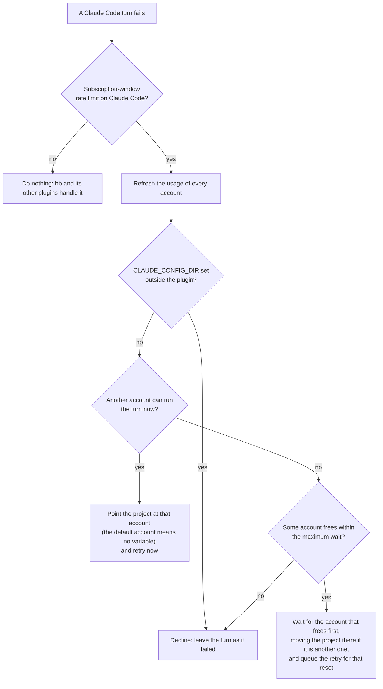

# Claude Switcher for bb

[](https://github.com/Finolaina/bb-plugin-claude-switcher/actions/workflows/check.yml)
[](LICENSE)
[](https://github.com/get-bb/bb)
[](#requirements)

A [bb](https://github.com/get-bb/bb) plugin for people who run Claude Code
with more than one subscription. It shows every Claude Code account it
finds (`~/.claude` plus the extra account directories) in bb's **Provider
usage** panel and, when a turn fails on a subscription limit, moves the
project to another account and retries the turn there, so a limit stops
you less often.


## Contents

- [Features](#features)
- [How it works](#how-it-works)
- [How it integrates with bb](#how-it-integrates-with-bb)
- [Requirements](#requirements)
- [Installation](#installation)
- [Setting up extra accounts](#setting-up-extra-accounts)
- [Configuration](#configuration)
- [The switch policy](#the-switch-policy)
- [CLI](#cli)
- [Update and uninstall](#update-and-uninstall)
- [Troubleshooting](#troubleshooting)
- [Privacy and security](#privacy-and-security)
- [Disclaimer](#disclaimer)
- [Contributing](#contributing)
- [License](#license)

## Features

- **Every account in one panel.** The 5-hour session, the weekly and the
  per-model weekly windows of each account appear in Provider usage, next
  to the usage bb already shows. Refreshed in the background and on demand.
- **Automatic switch and retry.** When a turn fails on a
  `subscription-window` rate limit, the plugin moves the project to the
  best other account and retries the failed turn there.
- **Waits instead of giving up.** When no account is free, the project
  moves to the account that frees first and the retry is queued for that
  reset, within a maximum wait you choose.
- **A preferred model.** Name one (for example `Fable`) and only accounts
  that can still run it are chosen.
- **Manual control.** A **Claude Switcher** section in Settings with a
  per-project account picker and a refresh button, and a
  `bb claude-switcher` CLI.
- **Plays well with bb.** It cooperates with bb's bundled provider-retry
  plugin and never touches a `CLAUDE_CONFIG_DIR` it did not set.


## How it works

One account is one Claude Code config directory (`CLAUDE_CONFIG_DIR`).
The plugin measures every account in the background. When a turn fails,
it decides between three outcomes:



A retry keeps the thread's model: the plugin changes which account runs a
thread, never which model it runs. After five attempts on the same turn it
stops.

## How it integrates with bb

The plugin uses only public surfaces of the bb plugin SDK:

| bb surface                                                       | What the plugin does with it                                                               |
| ---------------------------------------------------------------- | ------------------------------------------------------------------------------------------ |
| Provider usage source (the panel's RPC contract)                 | Publishes one resource per account, with its session, weekly and per-model windows.        |
| `turn.failed` event                                              | Detects subscription-window rate limits of the Claude Code provider.                       |
| Project machine environment variables                            | Sets `CLAUDE_CONFIG_DIR` on the project, with a note naming the account.                   |
| `threads.retry` and queued messages                              | Retries the failed turn now, or at a reset, and reuses the retry provider-retry queued.    |
| Settings and a settings section                                  | The six settings below, plus the per-project picker and the account cards.                 |
| CLI registration                                                 | `bb claude-switcher list`, `refresh`, `use` and `release`.                                 |
| Background service, key-value storage, realtime signals, logging | Periodic usage refresh, the last automatic switch, live updates of the section, and a log. |

Every switch, wait and decline is written to `bb plugin logs claude-switcher`.

### Interaction with bb's provider-retry

bb's bundled **provider-retry** plugin also listens to `turn.failed` and
queues one retry at the reset the provider reported; bb keeps a single
retry per turn. This plugin cooperates with it: after switching, it sends
the retry provider-retry already queued (the project is on the new account
by then) instead of queueing a second one, and when it has to wait it
replaces that retry with its own timed one. Keep provider-retry enabled:
disabling it is global and would also drop its retries for overloads and
for other providers.

## Requirements

- **bb 0.44 or later** (plugin SDK 0.5.29 or later) running on the machine
  that holds the Claude Code logins: macOS (keychain) or Linux
  (credentials file). The plugin runs inside bb's server process.
- **Threads that run on that same machine.** `CLAUDE_CONFIG_DIR` is set as
  a project **machine** environment variable, a local path; a thread
  executed on another host does not see the switch.
- **More than one Claude Code login**, each in its own config directory,
  set up as described in [Setting up extra accounts](#setting-up-extra-accounts).

## Installation

From the bb plugin catalog, once listed: open **Plugins → Browse
plugins**, find **Claude Switcher** and install it, or run
`bb plugin install claude-switcher`.

From this repository:

```sh
bb plugin install git:https://github.com/Finolaina/bb-plugin-claude-switcher@^0.2.0
```

From a checkout:

```sh
git clone https://github.com/Finolaina/bb-plugin-claude-switcher.git
cd bb-plugin-claude-switcher
npm install          # dependencies the settings section imports
bb plugin install .  # bb builds the plugin at install time
```

Then open **Settings → Claude Switcher** (or run
`bb plugin config claude-switcher`).

## Setting up extra accounts

The default account is `~/.claude`, the CLI's own directory (its login
lives in `~/.claude.json`). Every other account is a subdirectory of the
_accounts directory_ setting (`~/.claude-accounts` by default) that
contains a `.claude.json`.

**1. Share what a thread needs.** A switch changes the whole config
directory of the project: Claude Code reads its settings, hooks,
`CLAUDE.md`, plugins and, above all, the session transcripts
(`<dir>/projects/`) from there. A fresh directory has none of them, and a
thread whose transcript lives under another directory cannot be resumed
("No conversation found with session ID"). Symlink what must follow the
thread from `~/.claude` into each account directory before its first use,
at least `projects`, and normally `settings.json`, `hooks`, `CLAUDE.md`
and `plugins`:

```sh
acct=~/.claude-accounts/work
mkdir -p "$acct"
for f in projects settings.json hooks CLAUDE.md plugins; do
  [ -e ~/.claude/$f ] || continue
  [ -L "$acct/$f" ] || { [ -e "$acct/$f" ] && mv "$acct/$f" "$acct/$f.orig.$(date +%Y%m%d%H%M%S)"; }
  ln -sfn ~/.claude/$f "$acct/$f"
done
```

Run it when you create the directory or later; it is safe to repeat.
What Claude Code already created there is kept as `<name>.orig.<time>`,
so transcripts of sessions already run on that account stay in
`projects.orig.<time>` (move them into `~/.claude/projects/` if you want
to resume them). A plain `ln -s` is wrong once `projects/` exists: it
links inside it and says nothing.

**2. Log in once**, with the exact path the _accounts directory_ setting
names (no trailing slash: Claude Code keys the login by that string):

```sh
CLAUDE_CONFIG_DIR=~/.claude-accounts/work claude   # then /login
```

The plugin finds the new account on its next refresh.

MCP servers added with `claude mcp add -s user` live in each directory's
`.claude.json` (it also holds the login, so it cannot be shared): add them
again per account, or use a project-level `.mcp.json`. Without shared
transcripts, the retry of the failed turn itself fails with "No
conversation found", no thread can move between accounts in either
direction, and a thread that starts on a fresh account runs without your
settings, hooks and `CLAUDE.md`.

## Configuration

| Setting              | Default              | Meaning                                                                                                                                                   |
| -------------------- | -------------------- | --------------------------------------------------------------------------------------------------------------------------------------------------------- |
| `accountsDir`        | `~/.claude-accounts` | Where the extra config directories live.                                                                                                                  |
| `defaultAccountName` | `default`            | Name shown for `~/.claude`. A subdirectory with the same name is skipped, with a warning in the log.                                                      |
| `preferredModel`     | _(empty = any)_      | Model display name as the usage API reports it (e.g. `Fable`, case-insensitive). Only accounts that can still run it are chosen; else wait for its reset. |
| `autoSwitch`         | `true`               | Switch and retry on subscription limits. Off = the panel and the picker only.                                                                             |
| `maximumWaitHours`   | `6`                  | Queue a retry for a reset only if it is closer than this (0 = no limit).                                                                                  |
| `refreshMinutes`     | `5`                  | Background usage refresh interval (never below 1).                                                                                                        |

## The switch policy

The three Claude Code limits reset on their own clocks and are **not**
interchangeable. An account is usable while its session and weekly
windows are both present and under 100 %, and the provider reports no
lock. A window whose reset time has passed counts as free even if the
last measurement said otherwise. One exception: when the last measurement
is older than twice the refresh interval and the usage endpoint has
failed since, a block that only the clock says is over (for the whole
account or for the preferred model) is not trusted, and an account whose
only blocks are of that kind is left out; if no account is left, the
plugin declines rather than guess. A block whose reset is still ahead
remains a reason to wait, and an old measurement that was free remains a
candidate.
Usable accounts are ranked by the closest weekly reset, then by the lowest
session use, then by name. With a preferred model, only accounts that can
still run it are chosen. The account that just failed is excluded from
that decision and is never expected back before the reset the provider
itself reported for it.

A switch sets `CLAUDE_CONFIG_DIR` on the thread's **project** and retries
the failed turn. A wait moves the project to the account that frees first
(when that is another one; an exact tie stays on the current account, then
goes by name) and retries with `sendAt` at that reset, plus a 15 s buffer
and up to 30 s of jitter, like bb's own provider-retry plugin; both stop
after 5 attempts. The reasons this plugin writes are
`Switched to account <name>[ (<model>)]`, `Waiting for [<model> on ]<name>`
and `Retrying on account <name>`. Every one goes to
`bb plugin logs claude-switcher`; the one that moved the project is also
in **Settings → Claude Switcher** ("Last automatic switch"); the reason
stored with a retry this plugin created is shown wherever bb shows a
retry's reason.

For a minute after a switch or a wait, other turns of the same project
that were still running keep failing; each of those is retried once as it
is, on the new account (or queued for the same reset, after a wait),
without a second switch. A thread that fails again inside that minute is
judged afresh: the new account fails too.

The plugin only ever changes a `CLAUDE_CONFIG_DIR` it wrote itself. A
project whose variable was set by hand or inherited from the global
environment is shown as external, never switched, and its picker is
disabled. A variable of its own that names an account that no longer
exists counts as "no account": the picker shows "account no longer exists:
pick one" until the next switch or pick replaces it. Accounts without a
login are listed in the picker as "(not logged in)"; pinning one is
allowed, and the project then runs on it as soon as you log in there.

## CLI

```sh
bb claude-switcher list [--json]          # windows per account, account per project
bb claude-switcher refresh [--json]       # query the usage endpoint now
bb claude-switcher use <project> <account | default>   # project id, or its name when unique
bb claude-switcher release                # remove every CLAUDE_CONFIG_DIR this plugin set
```

`default` means the default account unless a subdirectory is actually
named `default`; the default account's own name always works.

## Update and uninstall

`bb plugin update claude-switcher` installs the newest release the range
you installed with allows (`bb plugin outdated` previews it); `^0.2.0`
stays below 0.3.0. bb refuses to reinstall an installed plugin with
another source, so moving to 0.3 or later means noting your settings,
running `bb plugin remove claude-switcher` (which deletes them) and
installing again with `@^0.2.0`. The project variables it set stay in
place and the reinstalled plugin recognises them by their note.

Removing or disabling the plugin does not remove the `CLAUDE_CONFIG_DIR`
variables it set on projects: they keep pointing at the account
directories. Turn `autoSwitch` off (or the next limit would set one
again), run `bb claude-switcher release` (projects return to the default
account; external variables are left alone; a project it could not
release is reported and the command exits 1), then
`bb plugin remove claude-switcher`. Any left behind can be found by the
note `Claude Code account "<name>" (set by the Claude Switcher plugin)` in
a project's machine environment.

## Troubleshooting

- **The retry fails with "No conversation found with session ID".** The
  account directory does not share `projects/` with `~/.claude`. Run the
  block in [Setting up extra accounts](#setting-up-extra-accounts).
- **An account shows "Not logged in".** Log in once with
  `CLAUDE_CONFIG_DIR=<exact path> claude`, using the same path the
  _accounts directory_ setting produces, without a trailing slash.
- **A project's picker is disabled.** Its `CLAUDE_CONFIG_DIR` was set by
  hand or inherited from the global environment. The plugin never changes
  it; remove it where it was set (the project's machine environment, or
  the global one) to let the plugin manage the project.
- **Nothing happens when a limit is hit.** Check that `autoSwitch` is on,
  that the thread runs on the same machine as bb's server, and read
  `bb plugin logs claude-switcher`: every declined switch is logged with
  its reason. Limits that are not Claude Code subscription-window limits
  and turns already on their fifth attempt are logged at debug level
  only, and nothing is logged while `autoSwitch` is off.

## Privacy and security

- The plugin reads the OAuth token Claude Code stored for each login on
  the machine: the macOS keychain (`Claude Code-credentials` for
  `~/.claude`, `Claude Code-credentials-<sha256(NFC(dir))[:8]>` for the
  others) or `<dir>/.credentials.json` elsewhere.
- It calls only Anthropic's own endpoints: the usage endpoint behind
  `claude`'s `/usage` (`GET https://api.anthropic.com/api/oauth/usage`)
  and, when a token has already expired, the OAuth endpoint the CLI uses
  to refresh it, with Claude Code's public OAuth client id. The rotated
  token is written back where the CLI keeps it and verified by reading it
  again; if the store rejects it, it stays in memory, is reported in the
  panel and is written as soon as the store works again, because the
  refresh token rotates and losing it logs the account out.
- Known limit: refreshing rotates the refresh token. If a running
  `claude` session of the same account refreshes between the plugin's
  read and its write, or bb stops while a rotated login is still only in
  memory, that account can be logged out and needs `/login` again.
- It does this in the background whether or not `autoSwitch` is on.
- No telemetry, no third-party services, no data leaves the machine except
  those calls to Anthropic. It moves projects between logins that already
  exist; it never logs anyone in and never shares or pools accounts
  between people.
- Like every bb plugin, it is full-trust code running in bb's server
  process. See [SECURITY.md](SECURITY.md) to report a vulnerability.

## Disclaimer

This is an independent, community project. It is not affiliated with,
endorsed by or supported by Anthropic or by the bb project. "Claude" and
"Claude Code" are trademarks of Anthropic.

To work, the plugin reads the OAuth token Claude Code stores for each
login, sends it to Anthropic's usage endpoint and, once it has expired,
refreshes it with Claude Code's public OAuth client id and writes the new
token back to the keychain or credentials file. Anthropic's
[Claude Code legal and compliance page](https://code.claude.com/docs/en/legal-and-compliance)
says OAuth login is intended for ordinary use of Claude Code, that
developers may not "collect, store, or intermediate Claude.ai credentials
or session tokens", and that Anthropic may take enforcement measures
without prior notice. Anthropic has not reviewed or endorsed this plugin
and may consider this use outside its terms. Your use of Claude Code and
your subscriptions remains subject to those terms, and you are
responsible for complying with them.

The plugin itself is free software under the [MIT License](LICENSE): anyone
may use, copy, modify and redistribute it, for any purpose. It is provided
"as is", without warranty of any kind.

## Contributing

Issues and pull requests are welcome. See [CONTRIBUTING.md](CONTRIBUTING.md)
for the development setup and the checks a change must pass, and
[CHANGELOG.md](CHANGELOG.md) for the release history.

## License

[MIT](LICENSE) © Aitor Mariscal. Free to use, modify and redistribute,
for any purpose.
